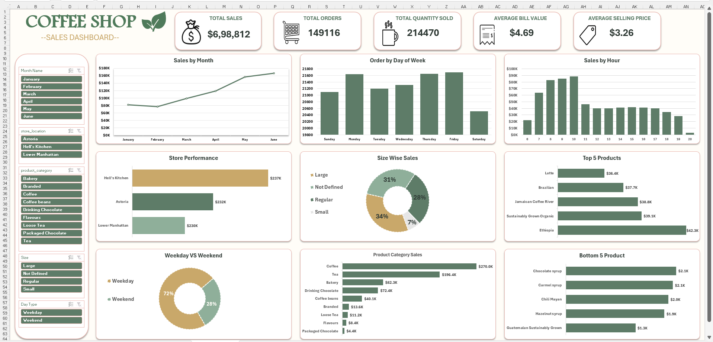

#  Coffee Shop Sales Dashboard

An interactive Excel dashboard developed to analyze coffee shop sales data and provide actionable business insights. This project transforms raw transactional data into meaningful visualizations, helping businesses monitor performance, identify trends, and support data-driven decision-making.

##  Project Overview

This dashboard analyzes sales performance across different time periods, store locations, product categories, and customer purchasing patterns. It allows users to filter data dynamically and quickly identify key business insights.

##  Business Objectives

- Analyze overall sales performance.
- Identify monthly sales trends.
- Understand customer purchasing behavior.
- Compare store performance.
- Evaluate product and category performance.
- Support business decision-making using interactive visualizations.

##  Tools Used

- Microsoft Excel
- Power Query
- Power Pivot
- PivotTables
- PivotCharts
- DAX (Data Analysis Expressions)
- Slicers
- Conditional Formatting

##  Key Performance Indicators (KPIs)

- Total Sales
- Total Orders
- Total Quantity Sold
- Average Order Value (AOV)
- Average Selling Price (ASP)

##  Business Questions Answered

- How do sales vary across different months?
- Which day of the week receives the highest number of customer orders?
- During which hours does the coffee shop experience the highest sales?
- Which store location generates the highest sales?
- Which products are the top and bottom performers by sales?
- Which beverage size contributes the most sales?
- How do weekday and weekend sales compare?
- Which product category generates the highest revenue?

##  Dashboard Features

- Interactive dashboard with dynamic slicers
- Sales trend analysis
- Store performance comparison
- Product category analysis
- Top & Bottom product analysis
- Hourly sales analysis
- Weekday vs Weekend comparison
- Beverage size analysis
- KPI summary cards

##  Analysis Report

This project also includes a detailed **Analysis_Report.pdf**, which explains the business findings, insights, and recommendations derived from the dashboard.


## Files Included

```text
Coffee-Shop-Sales-Dashboard/
│
├── README.md
├── Coffee Shop Sales Excel Project.xlsx
├── Analysis_Report.pdf
├── Dashboard.png
└── Coffee Shop Sales(RAW DATA).xlsx
```


## 📷 Dashboard Preview



##  Key Insights

- Sales showed a steady upward trend, with June recording the highest revenue.
- Fridays generated the highest number of customer orders.
- Peak sales occurred during the morning hours.
- Hell's Kitchen was the top-performing store.
- Coffee was the highest revenue-generating product category.
- Large-sized beverages contributed the most sales.
- Weekday sales significantly exceeded weekend sales.

##  Author

**Kashish Baghel**

Aspiring Data Analyst

##  Skills Demonstrated

- Data Cleaning
- Data Transformation
- Data Modeling
- Dashboard Design
- Business Analysis
- KPI Development
- Data Visualization
- Interactive Reporting
